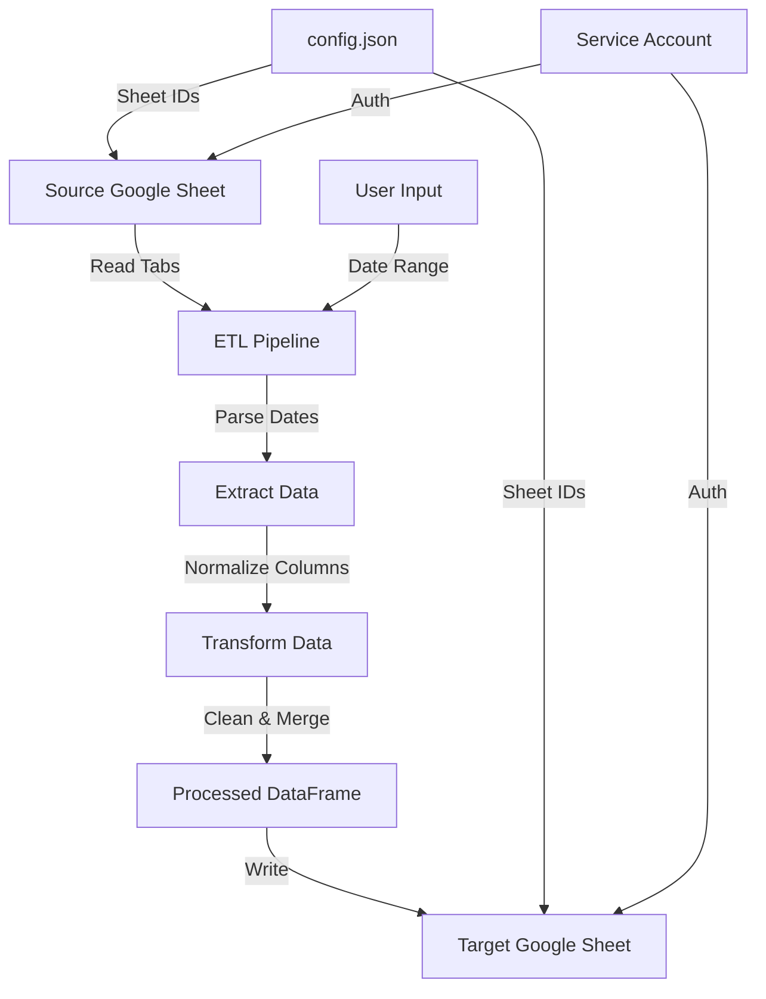

# ETL App - Repository Context

## 📋 Project Overview

This is a **Meta Table ETL Cleaning** tool that automates the process of:
1. Reading data from **Source Google Sheets**
2. Cleaning and transforming the data
3. Writing cleaned data to a **Target Google Sheet**

The application is built with **Streamlit** for the user interface and uses **Google Sheets API** via `gspread` for data operations.

---

## 🏗️ Architecture

### Application Structure

```
ETL-App-main/
├── app.py                 # Main Streamlit application entry point
├── requirements.txt        # Python dependencies
├── config.json            # Configuration (auto-generated if missing)
├── run_app.command        # macOS launcher script
├── run_app.bat            # Windows launcher script
├── setup_env.command       # macOS setup script
├── setup_env.bat          # Windows setup script
├── src/
│   ├── config.py          # Configuration loader and constants
│   ├── sheets.py          # Google Sheets API operations
│   ├── etl.py             # ETL pipeline logic
│   └── utils.py           # Date parsing and column normalization utilities
└── tests/                 # Test files (debug_utils, test_fix, etc.)
```

### Data Flow



### Key Components

#### 1. **app.py** - Streamlit UI
- Two main pages:
  - **Run Pipeline**: Execute ETL with date range selection
  - **Manage Target Sheet**: Delete old run tabs
- Uses session state for navigation
- Custom CSS for button styling (green run, red delete)

#### 2. **src/config.py** - Configuration Management
- Loads `config.json` from project root
- Raises error if config.json is missing (must be created by setup script)
- Exposes:
  - `SOURCE_SHEET_ID`: Source Google Sheet ID
  - `TARGET_SHEET_ID`: Target Google Sheet ID
  - `SERVICE_ACCOUNT_FILE`: Path to service account JSON
  - `START_DATE` / `END_DATE`: Optional date range defaults

#### 3. **src/sheets.py** - Google Sheets Operations
- `connect()`: Authenticates using service account credentials
- `write_latest_week()`: Writes DataFrame to target sheet with auto-incrementing tab names
- `get_all_tabs()`: Lists all tabs in target sheet
- `delete_tabs()`: Deletes specified tabs from target sheet
- `write_df_to_sheet()`: Low-level DataFrame writing with date formatting

#### 4. **src/etl.py** - ETL Pipeline
- `run_etl_pipeline()`: Main pipeline orchestrator
- `get_tabs_in_range()`: Filters tabs by date range
- `process_worksheet()`: Processes individual sheet tabs
- `coerce_numeric_columns()`: Converts text columns to numeric where appropriate

#### 5. **src/utils.py** - Utilities
- `parse_tab_date()`: Parses tab names (DDMM, DD/MM/YYYY formats)
- `parse_col_date()`: Parses column headers for dates
- `is_date_header()`: Detects if column header is a date
- `normalize_columns()`: Converts column names to snake_case
- `parse_tab_datetime()`: Parses "Run N - [timestamp]" format tabs

---

## 🚀 Setup Instructions

### Prerequisites
- Python 3.x installed
- Google Cloud Service Account JSON file
- Access to Source and Target Google Sheets

### macOS Setup

1. **First Time Setup**:
   ```bash
   # Option 1: Double-click setup_env.command (recommended)
   # Option 2: Terminal
   chmod +x setup_env.command
   ./setup_env.command
   ```
   
   The setup script will:
   - Create virtual environment (`.venv`)
   - Install Python dependencies
   - Create `src/gcp-service-account/` directory
   - Create `config.json` with skeleton structure

2. **Run Application**:
   ```bash
   # Option 1: Double-click run_app.command
   # Option 2: Terminal
   chmod +x run_app.command
   ./run_app.command
   ```

3. **If Gatekeeper Blocks Execution**:
   ```bash
   # Remove quarantine attributes
   xattr -d com.apple.quarantine run_app.command
   xattr -d com.apple.quarantine setup_env.command
   ```

### Windows Setup

1. **First Time Setup**: Double-click `setup_env.bat`
   
   The setup script will:
   - Create virtual environment (`.venv`)
   - Install Python dependencies
   - Create `src\gcp-service-account\` directory
   - Create `config.json` with skeleton structure

2. **Run Application**: Double-click `run_app.bat`

### Configuration

**After running the setup script**, you need to configure:

1. **Service Account**:
   - Place your Google Cloud service account JSON file at:
     `src/gcp-service-account/service_account.json`
   - Ensure the service account has access to both Source and Target sheets

2. **config.json**:
   - Created automatically by setup script
   - Edit the file and add your Sheet IDs:
     ```json
     {
       "source_sheet_id": "YOUR_SOURCE_SHEET_ID",
       "target_sheet_id": "YOUR_TARGET_SHEET_ID",
       "service_account_file": "src/gcp-service-account/service_account.json",
       "start_date": "2024-01-01",  // Optional
       "end_date": "2024-12-31"      // Optional
     }
     ```

---

## 🔑 Key Concepts

### Date Extraction Logic

**Priority Order**:
1. **Tab Name** (highest priority)
   - If tab is named "2212" (DDMM format), ALL rows in that tab are assigned to Dec 22nd
   - This overrides any conflicting dates in column headers
2. **Column Headers** (fallback)
   - Parsed if tab name doesn't contain a date
   - Supports formats: "12/12", "12-12", "December 12", "Dec 12", etc.

### Tab Naming Conventions

**Source Sheets**:
- Date-based: `2212` (DDMM), `12/12/2024`, `12-12-2024`
- Used to determine which tabs to process for a date range

**Target Sheets**:
- Run-based: `Run 1 - [DD/MM/YYYY HH:MM:SS]`
- Auto-increments: Finds highest "Run N" and creates "Run N+1"
- Old format also supported: `run N [YYYY-MM-DD_HH-MM-SS]`

### Column Normalization

- All column names converted to **lowercase snake_case**
- Special handling: Headers containing "Total Account Followers" → `total_account_followers`
- Duplicate column names get numeric suffixes (`column_1`, `column_2`, etc.)

### Data Processing

1. **Model Rows**: Sheets contain merged model name rows across columns
2. **Data Rows**: Follow model rows until next model row
3. **Date Columns**: If detected, data is pivoted (melted) from wide to long format
4. **Numeric Conversion**: Columns with >30% numeric content are auto-converted
5. **Summary Row Removal**: Removes rows like "Total Active Accounts Today"

---

## 📊 Data Flow Details

### ETL Pipeline Steps

1. **Connect**: Authenticate to Google Sheets API
2. **Filter Tabs**: Select tabs within date range
3. **Process Each Tab**:
   - Parse model rows and data rows
   - Extract dates from tab name or column headers
   - Pivot date columns if present
   - Normalize column names
4. **Combine**: Concatenate all processed tabs
5. **Transform**:
   - Merge `total_account_followers*` columns
   - Coerce numeric columns
   - Remove summary rows
   - Filter to date range
6. **Write**: Create new tab in target sheet with timestamp

### Date Range Logic

- **User-Defined**: If start/end dates provided in UI or config, use those
- **Auto-Default**: If not provided, finds latest tab date and looks back 6 days (7 days total)
- **Year Handling**: Uses year from start_date if provided, otherwise current year

---

## 🐛 Troubleshooting

### macOS Issues

**Gatekeeper Warning**:
- **Symptom**: "run_app.command Not Opened" dialog
- **Solution**: Remove quarantine: `xattr -d com.apple.quarantine run_app.command`

**Permission Denied**:
- **Symptom**: "Permission denied" when running script
- **Solution**: `chmod +x run_app.command`

### Application Issues

**Virtual Environment Not Found**:
- **Symptom**: Script exits with "Virtual environment (.venv) not found"
- **Solution**: Run `setup_env.command` (macOS) or `setup_env.bat` (Windows) first

**Connection Hangs**:
- **Symptom**: App hangs at "Connecting..."
- **Solutions**:
  - Check internet connection
  - Verify service account file exists and is valid
  - Ensure service account has access to sheets

**Address Already in Use** (Windows):
- **Symptom**: Streamlit port already in use
- **Solution**: Close other Streamlit instances or use `kill_app.bat` if available

**No Data Found**:
- **Symptom**: "No data found for the selected range"
- **Solutions**:
  - Check date range includes valid tab dates
  - Verify tab names match expected formats (DDMM, DD/MM/YYYY)
  - Ensure source sheet has data in selected tabs

**Config File Missing**:
- **Symptom**: Error: "Config file not found at config.json. Please run setup_env.command (macOS) or setup_env.bat (Windows) first to create it."
- **Solution**: Run the setup script (`setup_env.command` or `setup_env.bat`) to create `config.json`, then edit it with your sheet IDs

---

## 🔧 Development Notes

### Dependencies

- `streamlit`: Web UI framework
- `pandas`: Data manipulation
- `gspread`: Google Sheets API client
- `oauth2client`: Google authentication
- `openpyxl`: Excel file support (if needed)

### Testing

Test files in `tests/` directory:
- `test_fix.py`: Bug fixes
- `test_override.py`: Override logic tests
- `test_regression.py`: Regression tests
- `test_tab_logic.py`: Tab parsing logic
- `debug_utils.py`: Debug utilities

### Key Design Decisions

1. **Tab Date Priority**: Tab name overrides column dates (user requirement)
2. **Auto Tab Naming**: Increments "Run N" automatically
3. **Flexible Date Parsing**: Supports multiple date formats for robustness
4. **Numeric Coercion**: Smart detection (>30% numeric) before conversion
5. **Summary Row Filtering**: Removes common summary patterns

---

## 📝 File Reference

### Configuration Files
- `config.json`: User configuration (created by setup scripts)
- `requirements.txt`: Python package dependencies

### Scripts
- `run_app.command`: macOS launcher (runs Streamlit)
- `run_app.bat`: Windows launcher (runs Streamlit)
- `setup_env.command`: macOS setup script (creates venv, installs deps, creates config.json and gcp-service-account folder)
- `setup_env.bat`: Windows setup (creates venv, installs deps, creates config.json and gcp-service-account folder)

### Source Code
- `app.py`: Streamlit application with two pages
- `src/config.py`: Configuration management
- `src/sheets.py`: Google Sheets API wrapper
- `src/etl.py`: ETL pipeline implementation
- `src/utils.py`: Date parsing and column utilities

### Tests
- `tests/`: Various test files for debugging and validation

---

## 🔐 Security Notes

- Service account JSON contains sensitive credentials
- Keep `src/gcp-service-account/service_account.json` out of version control
- Ensure `.gitignore` excludes service account files
- Service account should have minimal required permissions (read source, write target)

---

## 📚 Additional Resources

- **Google Sheets API**: https://developers.google.com/sheets/api
- **Streamlit Docs**: https://docs.streamlit.io
- **gspread Library**: https://gspread.readthedocs.io

---

## 🎯 Quick Reference

### Common Commands

# macOS Setup (double-click setup_env.command or run in terminal)
./setup_env.command

# macOS Run (double-click run_app.command or run in terminal)
./run_app.command

# Remove Quarantine (if needed)
xattr -d com.apple.quarantine run_app.command
xattr -d com.apple.quarantine setup_env.command

# Check Virtual Environment
ls -la .venv

# Manual Run (if scripts fail)
.venv/bin/python -m streamlit run app.py
```

### Config.json Template

```json
{
  "source_sheet_id": "",
  "target_sheet_id": "",
  "service_account_file": "src/gcp-service-account/service_account.json",
  "start_date": "",
  "end_date": ""
}
```

---

*Last Updated: Based on repository analysis as of current date*